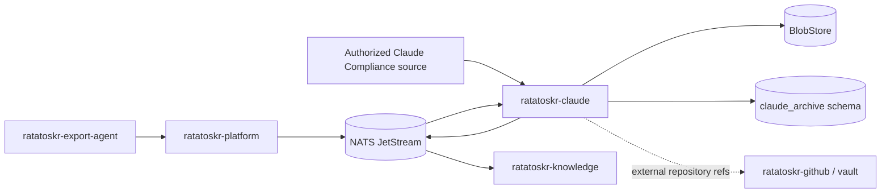
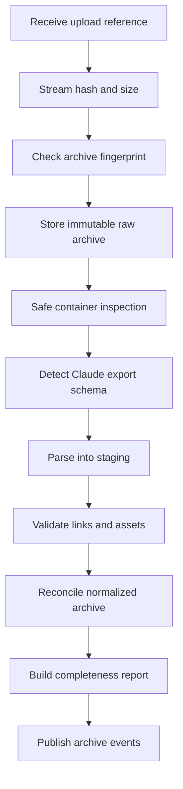

# Ratatoskr Claude Archive Architecture

> Status: target architecture. This repository is in architecture bootstrap. Claude export schemas and compliance APIs are external contracts and must be handled through versioned adapters and verified fixtures.

## 1. Purpose

`ratatoskr-claude` creates a local, immutable, searchable archive of Claude product data.

It owns:

- personal and organization Data Export archives;
- optional Enterprise Compliance ingestion;
- Claude account and organization archive identity;
- projects and project instructions;
- project knowledge and uploaded sources;
- conversations as branching graphs;
- messages and heterogeneous content parts;
- uploaded files;
- Artifacts and Artifact versions;
- provider-specific raw records;
- snapshot and revision history;
- completeness reports;
- portable Markdown/JSON archive generation.

It is not an Anthropic inference gateway and does not treat the Messages API as the source of Claude.ai history. It does not automate consumer website login or store browser sessions.

## 2. Architectural position



The archive service owns Claude-specific evidence and normalized archive state. Knowledge owns analysis/search. External GitHub or Drive references remain references unless another owning service preserves their content.

## 3. Repository structure

```text
ratatoskr-claude/
├── crates/
│   ├── claude-domain/
│   ├── archive-intake/
│   ├── schema-detection/
│   ├── export-parsers/
│   ├── reconciliation/
│   ├── projects/
│   ├── project-knowledge/
│   ├── conversations/
│   ├── artifacts/
│   ├── completeness/
│   ├── portable-export/
│   ├── compliance-adapter/
│   ├── persistence/
│   ├── eventing/
│   ├── telemetry/
│   └── test-support/
├── services/
│   └── claude/
├── migrations/
├── fixtures/
│   ├── synthetic-exports/
│   └── malformed-archives/
├── tests/
└── docs/
```

Consumer exports, organization exports, and Compliance ingestion share normalized domain types but remain separate acquisition adapters.

## 4. Bounded context and data ownership

Recommended schema:

```text
claude_archive.accounts
claude_archive.organizations
claude_archive.provider_exports
claude_archive.import_runs
claude_archive.import_warnings
claude_archive.projects
claude_archive.project_revisions
claude_archive.project_instructions
claude_archive.project_sources
claude_archive.project_source_revisions
claude_archive.conversations
claude_archive.conversation_revisions
claude_archive.messages
claude_archive.message_revisions
claude_archive.message_edges
claude_archive.content_parts
claude_archive.attachments
claude_archive.artifacts
claude_archive.artifact_versions
claude_archive.external_references
claude_archive.unknown_records
claude_archive.completeness_reports
claude_archive.tombstones
claude_archive.compliance_cursors
claude_archive.outbox
claude_archive.inbox
```

The service writes only to `claude_archive.*`.

It does not own global identity, Anthropic model inference state, embeddings, cross-provider search, Git repository bytes, or Google Drive backup.

## 5. Acquisition modes

```text
ConsumerExport
OrganizationExport
ComplianceApi
ManualConversationCapture
LegacyImport
```

Every observation retains its acquisition mode, source snapshot, parser version, and provider record location.

### 5.1. Personal export

For personal accounts, the supported path is an official user-requested archive delivered through Export Agent or explicit upload.

```text
request Claude export
-> download archive
-> Export Agent hashes and uploads
-> Claude service stores immutable archive
-> versioned parser imports snapshot
```

This is snapshot-based backup, not continuous synchronization.

### 5.2. Organization export

Organization exports may include broader workspace data and are imported as immutable snapshots tied to organization identity and export authority.

### 5.3. Compliance API

An authorized Enterprise adapter may continuously retrieve chats, files, project data, and activity records exposed by the configured API.

Compliance is an additional observation path, not a guarantee that every consumer/UI asset is available. Full export reconciliation remains useful where supported.

## 6. Raw-first archive intake



The provider archive remains available for future parser versions even if normalization is partial or fails.

### 6.1. Export record

```text
provider export ID when available
account/organization reference
acquisition mode
requested, received, and imported timestamps
archive SHA-256 and size
raw BlobRef
detected schema
parser version
import state
completeness status
warnings
```

Duplicate archive hashes are idempotent. Reprocessing uses an explicit parser/version request and creates a new import run without duplicating the raw object.

## 7. Safe archive handling

Exports are hostile input.

Controls:

- reject absolute and traversal paths;
- cap file count, nesting, compressed and decompressed bytes;
- detect archive bombs and duplicate-path ambiguity;
- reject device/special files and unsafe links;
- MIME sniff;
- never execute code or render active HTML;
- isolate temporary extraction;
- use content-addressed storage;
- preserve unknown sections as raw evidence;
- remove temporary data only after durable state is recorded.

Provider file names remain metadata and never determine filesystem placement.

## 8. Schema detection and versioned parsers

Detection uses archive structure, known manifests, filenames, and JSON shape. It reports confidence and unknown sections.

```rust
pub trait ExportParser {
    fn parser_id(&self) -> ParserId;
    fn supports(&self, detected: &DetectedSchema) -> bool;
    fn parse(&self, archive: &ArchiveView) -> Result<StagedExport, ParseError>;
}
```

Parsers write staging records. A reconciliation step validates identity and relationships before updating current projections.

Unknown fields, record families, content parts, and assets are retained with source path/hash and warning metadata.

## 9. Durable import state machine

```text
received
-> raw_stored
-> inspected
-> schema_detected
-> parsing
-> staged
-> validating
-> reconciling
-> reporting
-> completed
```

Alternative states:

```text
duplicate
partial
failed_transient
failed_permanent
quarantined
cancelled
```

State transitions are durable and restartable. Completion requires committed normalized data and a completeness report.

## 10. Project architecture

A Claude Project can include:

- provider project ID;
- title and description;
- project instructions;
- project knowledge sources;
- conversations;
- visibility and collaboration metadata;
- owner/organization references;
- external GitHub/Drive references;
- created, updated, archived, access-lost, or deleted observations.

### 10.1. Project revisions

Project title, instructions, membership, visibility, and source set are versioned independently. A new export can update one component without erasing previous observations.

### 10.2. Project identity

Stable provider ID is preferred. If absent, a provisional identity uses export-local references and deterministic fingerprints while preserving uncertainty.

## 11. Project knowledge

Project knowledge is a first-class archive component.

Source kinds:

```text
UploadedFile
PastedText
Code
GeneratedFile
GitHubReference
GoogleDriveReference
ExternalReference
Unknown
```

Each source records:

- provider source ID when available;
- project relationship;
- title/name;
- MIME/type;
- content hash and BlobRef when bytes are present;
- original external reference;
- first/last observed snapshot;
- completeness and availability;
- raw provider metadata.

### 11.1. External references

A GitHub or Drive reference does not mean the external content is backed up.

```text
reference observed
local bytes absent
-> locally_backed_up = false
```

GitHub repository preservation is delegated to `ratatoskr-github` and `ratatoskr-vault`. Future Drive preservation belongs to a dedicated connector.

## 12. Conversation graph

Conversations are graphs that preserve branching, edits, and generated alternatives.

```rust
pub struct ArchivedMessage {
    pub id: MessageId,
    pub conversation_id: ConversationId,
    pub external_id: Option<String>,
    pub parent_message_id: Option<MessageId>,
    pub role: MessageRole,
    pub content: Vec<ContentPart>,
    pub model: Option<String>,
    pub created_at: Option<DateTime<Utc>>,
    pub updated_at: Option<DateTime<Utc>>,
    pub provider_metadata: serde_json::Value,
}
```

Supported semantics:

- user/assistant turns;
- edited prompts;
- regenerated responses;
- branches;
- tool/system records where exported;
- interrupted messages;
- project membership changes;
- access/shared state observations.

Readable transcript views are derived from graph paths. The archive retains all known nodes and edges.

## 13. Content parts and attachments

Content parts may include:

```text
Text
Markdown
Image
File
Code
Citation
ToolCall
ToolResult
ArtifactReference
Unknown
```

Each part preserves provider type, order, normalized representation, content hash, source record, and raw metadata.

Attachment records include original filename, detected MIME, size, hash, BlobRef, project/message links, and missing/available state.

Unknown parts remain round-trippable.

## 14. Artifact architecture

Artifacts are first-class versioned objects rather than flattened message text.

```text
artifacts
  artifact ID
  project/conversation/message relationships
  type/language
  title
  current version
  first/last observed snapshot
  availability

artifact_versions
  version ID/order
  content or BlobRef
  content hash
  created/observed time
  provider metadata
```

Possible artifact types include code, documents, diagrams, HTML, React-like interactive content, and unknown provider formats.

### 14.1. Safety

Interactive or executable Artifacts are stored as data. Ratatoskr does not execute them during import or ordinary viewing. Any preview uses a separate sandbox and sanitization policy.

### 14.2. Version reconciliation

Provider version IDs are preferred. Otherwise versions are ordered through observed relationships, timestamps, and content hashes while retaining ambiguity warnings.

## 15. Snapshot and revision semantics

Every export is immutable evidence.

- normalized objects can accumulate observations across exports and compliance events;
- changed objects create revisions;
- one missing export object does not prove deletion;
- access loss, export omission, explicit deletion, and organization removal are distinct;
- hard deletion follows local retention policy;
- previously observed project knowledge and Artifacts are not silently erased.

Upstream state examples:

```text
present
missing_from_latest_snapshot
explicitly_deleted
access_lost
organization_access_lost
unknown
```

## 16. Reconciliation architecture

Stable provider IDs are used first. Fallback identity is deterministic and uncertainty-aware.

Reconciliation:

1. Maps staged account/organization identity.
2. Upserts project and conversation observations.
3. Constructs message graph.
4. Resolves project knowledge and attachments.
5. Resolves Artifacts and versions.
6. Preserves unresolved references.
7. Builds revisions and current projections.
8. Generates change events.
9. Produces completeness report.

A failed validation does not modify active projections.

## 17. Completeness reports

Dimensions include:

```text
projects discovered
project instructions present
project knowledge sources referenced
project knowledge bytes stored
conversations and messages discovered
branches resolved
attachments referenced/stored/missing
Artifacts and versions discovered
external references locally backed up/not backed up
unknown record variants
unresolved relationships
```

Statuses:

```text
Complete
ConversationsComplete
StructurallyPartial
AssetsPartial
Unknown
FailedValidation
```

`Complete` requires positive evidence for the supported export family. No parser may infer completeness merely from the absence of errors.

## 18. Compliance ingestion

The optional adapter uses a durable cursor.

```text
pull activity/chat/file/project records
-> preserve raw provider event
-> idempotently map observation
-> advance cursor after durable commit
-> publish change event
-> periodically reconcile with full export when available
```

Requirements:

- least-privilege organization credential;
- cursor and retention-window monitoring;
- bounded retries and rate limits;
- audit trail;
- separation of chat/file/project record authority;
- no assumption that every Artifact or UI-only setting is exposed.

## 19. Portable local export

Example structure:

```text
project-name/
├── project.json
├── README.md
├── instructions.md
├── conversations/
│   ├── conversation-id.json
│   └── conversation-id.md
├── knowledge/
├── artifacts/
│   ├── artifact-id/
│   │   ├── manifest.json
│   │   └── versions/
├── attachments/
├── external-references.json
└── manifest.json
```

The manifest records source snapshots, normalized schema version, hashes, missing assets, unresolved references, and Artifact safety metadata.

The portable archive is designed for local readability and recovery, not as a claimed official Claude import format.

## 20. Knowledge integration

The service publishes project, project-source, conversation, message, attachment, and Artifact references.

Knowledge may index:

- message windows and branches;
- conversations and projects;
- project instructions and knowledge sources;
- Artifact text/code versions;
- external reference metadata.

Knowledge does not gain Claude credentials or raw archive authority. Rebuilding search projections cannot alter archive records.

## 21. Commands and events

### 21.1. Commands consumed

```text
claude.export.import_requested.v1
claude.export.reprocess_requested.v1
claude.portable_export.requested.v1
claude.compliance.sync_requested.v1
claude.archive.reconcile_requested.v1
```

### 21.2. Events emitted

```text
claude.export.received.v1
claude.export.ingested.v1
claude.export.partial.v1
claude.export.failed.v1
claude.project.upserted.v1
claude.project_source.upserted.v1
claude.conversation.upserted.v1
claude.artifact.upserted.v1
claude.asset.stored.v1
claude.completeness.reported.v1
claude.portable_export.completed.v1
```

Events contain references and bounded metadata rather than private full conversation bodies or file bytes.

## 22. Persistence and transactions

Transactions group:

- import state transitions;
- staging-to-normalized reconciliation;
- revision/current projection changes;
- completeness metadata;
- outbox records.

Archive upload, BlobStore I/O, parsing, and compliance calls occur outside transactions with durable intermediate state.

At-least-once delivery uses command idempotency and inbox deduplication.

## 23. Privacy and retention

Claude archives may contain private chats, code, project documents, credentials pasted by users, and proprietary data.

Controls:

- encryption in transit and at rest;
- per-user/organization authorization;
- content excluded from logs and metric labels;
- configurable local-only Knowledge processing;
- separate metadata/content access;
- explicit purge and BlobStore verification;
- no cross-user content-equality leakage;
- no real exports committed as fixtures;
- controlled preview of Artifacts and HTML;
- retention policies for raw exports, normalized records, and portable exports.

Incognito or non-retained chats are archived only if the authorized source provides them. Completeness reports state the limits.

## 24. Failure model

### Transient

- upload interruption;
- BlobStore/database/event-bus outage;
- compliance timeout or throttling;
- worker interruption.

### Permanent or quarantined

- invalid/unsafe archive;
- schema too ambiguous;
- authorization mismatch;
- corrupted asset;
- unsupported active artifact requiring unsafe execution.

### Partial

- conversations complete but projects/knowledge incomplete;
- missing uploaded files;
- Artifacts present without all versions;
- external references not locally backed up;
- unknown record variants;
- compliance events without complete export context.

Partial archives remain usable with explicit warnings.

## 25. Security boundaries

- No consumer browser login automation, password storage, cookies, or undocumented session APIs.
- Official exports and authorized compliance APIs are supported acquisition paths.
- Archives, files, Artifacts, and provider records are hostile input.
- Active Artifacts/HTML/scripts are never executed during import.
- Compliance credentials remain isolated to the adapter.
- File names do not determine paths.
- Events/logs exclude private messages, files, credentials, signed URLs, and raw exports.
- External references do not authorize fetching or provider writes.
- Public access is mediated through Platform authorization.
- Knowledge receives approved source references, not credentials.

## 26. Observability

Required telemetry:

```text
claude_exports_received_total
claude_export_bytes
claude_import_duration_seconds
claude_import_status_total
claude_projects_imported_total
claude_project_sources_total
claude_conversations_imported_total
claude_messages_imported_total
claude_artifacts_imported_total
claude_artifact_versions_total
claude_assets_stored_total
claude_missing_assets_total
claude_unknown_records_total
claude_unresolved_relations_total
claude_compliance_lag_seconds
claude_completeness_status_total
queue_lag_seconds
```

Project titles, messages, filenames, code, and provider IDs are not unbounded metric labels.

## 27. Testing architecture

### Unit

- archive fingerprinting and idempotency;
- schema detection;
- parser mapping;
- project/source reconciliation;
- conversation graph construction;
- Artifact/version ordering;
- snapshot/deletion semantics;
- completeness classification;
- portable manifest generation.

### Integration

- SQLx migrations and transactions;
- BlobStore raw archives, attachments, and Artifact versions;
- interrupted/resumed import;
- outbox/inbox replay;
- fake compliance pagination and cursors;
- Knowledge event generation.

### Adversarial

- path traversal, archive bombs, and excessive files;
- malformed/mixed schemas;
- duplicate IDs and broken graph relations;
- active HTML/script artifacts;
- oversized files;
- missing knowledge sources;
- unknown content/artifact variants;
- access loss across snapshots.

### Fixture strategy

Use synthetic fixtures checked into Git. Real personal/organization exports remain in protected local fixture storage and are never included in PRs, logs, or CI artifacts.

### Workspace end-to-end

- Export Agent upload and operation progress;
- raw-first import and completeness report;
- project knowledge and Artifact viewer;
- Knowledge indexing/search;
- portable export;
- duplicate/reprocess behavior;
- off-host archive backup verification.

## 28. Deployment architecture

Runtime roles may include:

```text
archive intake/internal API
import worker
reconciliation worker
portable export worker
optional compliance sync worker
```

They may share one image with separate queues, concurrency, and permissions.

Dependencies:

- PostgreSQL `claude_archive` role;
- NATS JetStream;
- BlobStore;
- optional Compliance API credential;
- Platform registered-device upload flow.

No browser, Claude session cookie, Anthropic inference credential, Git CLI, or direct Knowledge database access is required.

## 29. Migration architecture

Legacy Claude captures/imports use `LegacyImport` provenance.

1. Preserve original files and metadata.
2. Store legacy raw artifacts.
3. Map known conversations/messages without inventing projects or Artifact versions.
4. Preserve unknown structures.
5. Import first official export.
6. Reconcile stable IDs, content hashes, and external references.
7. Build completeness report.
8. Index through Knowledge.
9. Keep legacy and official evidence separately traceable.

## 30. Architectural invariants

1. The service archives Claude product data, not Anthropic Messages API state.
2. Official exports are immutable raw evidence stored before parsing.
3. Consumer acquisition never uses browser-session automation.
4. Parsers are versioned and selected by detected schema.
5. Archives, attachments, and Artifacts are hostile input.
6. Conversations are graphs.
7. Project knowledge is first-class and can be partial.
8. Artifacts and Artifact versions are preserved separately.
9. External GitHub/Drive references are not considered backed up without local evidence.
10. Unknown records/content parts are retained.
11. Missing snapshot objects do not prove deletion.
12. Completeness is evidence-based.
13. Knowledge indexing does not own archive authority.
14. Compliance credentials remain adapter-local.
15. Events contain references, not private conversation bodies.
16. Delivery is at-least-once and handlers are idempotent.
17. Portable exports are local recovery formats, not claimed provider imports.

## 31. Evolution

Initial milestones:

1. Raw archive intake, hashing, BlobStore, and import state.
2. Real-fixture schema discovery and first consumer parser.
3. Conversation graph, content parts, and attachments.
4. Projects, instructions, project knowledge, and completeness.
5. Artifacts and version preservation with safe preview policy.
6. Platform/Export Agent integration.
7. Knowledge indexing and local viewer.
8. Portable Markdown/JSON export.
9. Optional Compliance adapter and export reconciliation.
10. Retention, purge, off-host verification, and recovery runbooks.

Changes to archive authority, Artifact execution policy, deletion semantics, consumer-session policy, or completeness rules require ADRs and coordinated workspace changesets.
